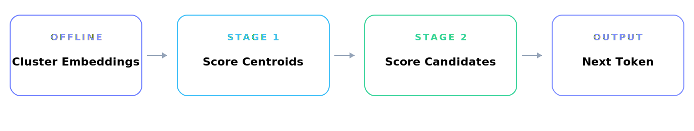
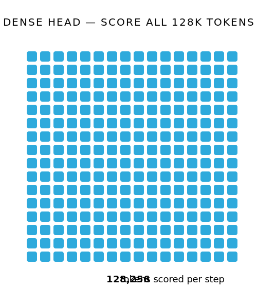
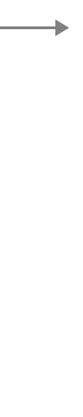
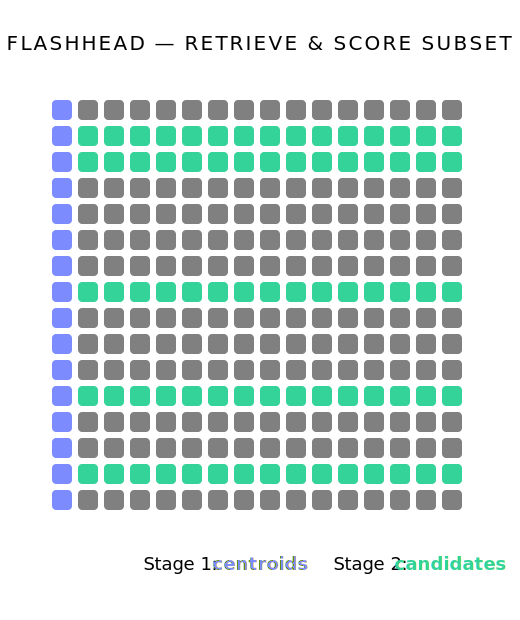

<div align="center">

# FlashHead 

### vLLM Plugin for Fast Language Model Head Inference


The dense classification head accounts for up to 60% of parameters in small LLMs and roughly half of decode-step compute. FlashHead replaces it with a two-stage retrieval pipeline — **up to 2.0x model-level inference speedup** while maintaining accuracy -- training-free and hardware-friendly. FlashHead integrates via vLLM's official `vllm.general_plugins` entry point: no source patches, no custom Docker image.

<a href="https://python.org/">
  
</a>
<a href="https://github.com/vllm-project/vllm">
  
</a>
<a href="https://github.com/embedl/flash-head/LICENSE">
    
</a>
<br>
<a href="https://arxiv.org/abs/2603.14591">
  
</a>
<a href="https://huggingface.co/collections/embedl/flashhead">
  
</a>
<a href="https://huggingface.co/spaces/embedl/Edge-Inference-Benchmarks">
  
</a>


</div>


## FlashHead: Efficient Drop-In Replacement for the Classification Head in Language Model Inference


The standard LM head computes a dense matrix multiplication $h_t × W_{vocab}$ at every decode step, scoring all Vocabulary tokens regardless of relevance. FlashHead reframes this as a two-stage retrieval problem over clustered token embeddings: first identify which regions of vocabulary space are relevant, then score only those candidates.

<p align="center">
  
</p>

> **⚡ Key Tradeoff** A dense head scores **128,256 tokens per step** (for a 128K vocabulary). With *c = 8,016* clusters and *p = 256* probes, FlashHead scores only **8,016 + 256 × 16 = 12,112 tokens**, a <span style="color:#22c55e; font-weight:600;">10× reduction</span> in scored tokens, while multi-probe retrieval maintains near-perfect recall of the correct next token.


<p align="center" width="100%">
  
  
  
</p>

<strong>Note.</strong> The offline clustering step runs once per model and adds zero overhead at inference time.
Both stages use contiguous memory access patterns for GPU and edge accelerator efficiency.


### Four key ideas (see [paper](https://arxiv.org/abs/2603.14591))

- **Equal-sized Clustering** Token embeddings grouped into **balanced clusters** for predictable memory access and stable latency. Unlike hierarchical softmax, cluster sizes stay uniform; critical for GPU and edge accelerators.

- **Multi-Probe Retrieval** Instead of committing to a single cluster, FlashHead probes multiple centroids - beam search over vocabulary space. Near-perfect recall with far fewer evaluations. 

- **Full Decoding Support** Supports both greedy and sampling decoding. For sampling, clusters are selected proportionally to centroid probabilities, **preserving the output distribution**. 

- **Selective Quantization** Stage 1 (coarse centroid scoring) runs in low precision; Stage 2 preserves accuracy. The head's quantization weakness becomes a **structural advantage**.


## 📦 Installation

**Prerequisites:** Python 3.10+ and [vLLM](https://github.com/vllm-project/vllm) >= 0.14.0

```bash
pip install flash-head
```

That's it. The plugin is discovered automatically by vLLM at startup. ✨

<details>
<summary>Install from source</summary>

```bash
git clone https://github.com/embedl/flash-head.git
cd flash-head
pip install .
```
</details>


## 🚀 Usage

### ⌨️ CLI

```bash
# FlashHead activates automatically for compatible models
vllm serve embedl/Cosmos-Reason2-2B-W4A16-Edge2-FlashHead \
    --host 0.0.0.0 --port 8000 \
    --gpu-memory-utilization 0.75 \
    --max-model-len 8192

# Disable without uninstalling
FLASHHEAD_ENABLED=0 vllm serve ...
```

### 🐍 Python

```python
from vllm import LLM, SamplingParams

llm = LLM(
    model="embedl/Cosmos-Reason2-2B-W4A16-Edge2-FlashHead",
    trust_remote_code=True,
)
outputs = llm.generate(
    ["Explain quantum computing."],
    SamplingParams(max_tokens=50),
)
print(outputs[0].outputs[0].text)
```

The model's `config.json` contains `"flash_head_cache_dir": "flash_head_assets"` which signals FlashHead to activate. Standard models without this field are completely unaffected.


## 🔧 vLLM Plugin Integration

1. **Discovery** vLLM discovers the `flash-head` plugin via the `vllm.general_plugins` entry point at startup
2. **Patching** `register()` is called in every process, intercepting logits computation, sampling, and speculative decoding
3. **Inference** The worker lazily constructs the FlashHead module on GPU from the model's clustering cache


## 🛡️ Safety

FlashHead models use a custom architecture name (e.g., `FlashHeadQwen3VLForConditionalGeneration`). Without the plugin installed, vLLM does not recognize the architecture and refuses to load the model. Users cannot accidentally run at reduced speed.

| Scenario                                | Behavior                                        |
|-----------------------------------------|-------------------------------------------------|
| Plugin not installed                    | ❌ vLLM errors: architecture not supported       |
| Plugin installed, `FLASHHEAD_ENABLED=0` | ⏸️ Clean disable, model loads without FlashHead |
| Plugin installed, enabled               | ✅ FlashHead loads on GPU, full speedup          |

### 🏗️ Supported Architectures

See most recent architectures in [_FLASHHEAD_ARCHITECTURES](https://github.com/embedl/flash-head/src/flash_head/__init__.py):
```python
_FLASHHEAD_ARCHITECTURES = {
    "FlashHeadLlamaForCausalLM": "vllm.model_executor.models.llama:LlamaForCausalLM",
    "FlashHeadQwen3ForCausalLM": "vllm.model_executor.models.qwen3:Qwen3ForCausalLM",
    "FlashHeadQwen3VLForConditionalGeneration": "vllm.model_executor.models.qwen3_vl:Qwen3VLForConditionalGeneration",
    "FlashHeadGemma3ForCausalLM": "vllm.model_executor.models.gemma2:Gemma2ForCausalLM",
}
```


## 📤 Publishing FlashHead Models

For the safety check to work, FlashHead models should use this `config.json` structure:

```json
{
  "architectures": ["FlashHeadQwen3VLForConditionalGeneration"],
  "model_type": "qwen3_vl",
  "flash_head_cache_dir": "flash_head_assets"
}
```

- `architectures` uses the `FlashHead*` prefix so vLLM rejects the model without the plugin
- `model_type` stays standard so vLLM can resolve the base model class
- `flash_head_cache_dir` points to the clustering cache directory
- Do NOT include `auto_map` -- the plugin handles registration


## 🗺️ Roadmap

- ✅ Core FlashHead plugin for vLLM (greedy decoding)
- ✅ Balanced clustering with multiprobe retrieval
- ✅ Inference-time sampling across full vocabulary
- ✅ Quantized model support
- 🔄 **Speculative decoding:** Full FlashHead integration with vLLM's speculative decoding pipeline *(in progress)*
- 🔄 **EAGLE draft proposals:** FlashHead-accelerated draft generation for EAGLE speculative decoding *(in progress)*
- ⬜ Additional model architectures
- ⬜ Benchmarks on additional edge platforms (Qualcomm, AMD, Intel, ...)

💡 Want a feature? [Open an issue](https://github.com/embedl/flash-head/issues/new)!


## 🤝 Contributing

We welcome contributions, feedback, and collaboration. Whether you're interested in adding support for new architectures, improving performance, or integrating FlashHead into your own inference stack -- we'd love to hear from you.

- **Report issues** Bug reports and feature requests help us improve. [Open an issue](https://github.com/embedl/flash-head/issues/new).
- **Submit PRs** Code contributions for new architectures, optimizations, or bug fixes.
- **Research collaboration** Working on efficient inference, vocabulary approximation, or edge deployment? Reach out.
- **Model contributions** Publish FlashHead-optimized models to the [HuggingFace collection](https://huggingface.co/collections/embedl/flash-head).
- **Benchmarks** Run FlashHead on your hardware and submit results to the [Edge Inference Benchmarks](https://huggingface.co/spaces/embedl/Edge-Inference-Benchmarks) space.


## 📂 Project Structure

```
flash-head/
├── src/flash_head/
│   ├── __init__.py              # Plugin entry point (register)
│   ├── flash_head.py            # Core clustering-based head
│   ├── loading.py               # Model/asset loading from HF Hub
│   └── patches/                 # vLLM runtime patches
│
├── pyproject.toml
└── LICENSE
```


## 📖 Citation

If you use FlashHead in your research, please cite:

```bibtex
@article{tranheden2026flashhead,
  title={FlashHead: Efficient Drop-In Replacement for the Classification Head in Language Model Inference},
  author={Tranheden, Wilhelm and Ahmed, Shahnawaz and Dubhashi, Devdatt and Matthiesen, Jonna and von Essen, Hannes},
  journal={arXiv preprint arXiv:2603.14591},
  year={2026}
}
```

## License

Free for non-commercial use within the Embedl Community License (v.1.0).

<div align="center">

### Interested in FlashHead?

Enterprise licensing, custom model optimization, and engineering support available.

[models@embedl.com](mailto:models@embedl.com) &nbsp;&bull;&nbsp; [embedl.com](https://embedl.com)

<br>

<sub>&copy; 2026 Embedl AB. All rights reserved.</sub>

</div>
